搭建Spark源码研读和代码调试的开发环境
-------

工欲善其事，必先利其器，第一篇笔记介绍如何搭建源码研读和代码调试的开发环境。
一些必要的开发工具，请自行提前安装：

* scala 2.11.8
* sbt 0.13.12
* maven 3.3.9
* git 2.10.2
* IntelliJ IDEA 2016.3 (scala plugin) 

本人使用macOS 10.12，所有笔记都基于这个系统，但是其他系统也可以很容易找到对应的解决方案，比如IDE的快捷键。

## 源码获取与编译

### 从Github上获取Spark源码
可以直接从Spark官方Github仓库拉取。本系列笔记基于**Spark 2.0.2**这个版本，所以先checkout这个tag，再进行之后的步骤：

```bash
$ git clone git@github.com:apache/spark.git
$ cd spark
$ git tag
$ git checkout v2.0.2 
$ git checkout -b pin-tag-202
```

如果想要push自己的commits，也可以fork到自己的Github账号下，再拉取到本地，可以参考我之前的文章：[Reading Spark Souce Code in IntelliJ IDEA](https://linbojin.github.io/2016/01/09/Reading-Spark-Souce-Code-in-IntelliJ-IDEA/)

### 编译Spark项目
参考[官方文档](https://github.com/apache/spark#building-spark)，编译很简单，这里使用4个线程，跳过tests，以此加速编译。这个编译会产生一些必要的源代码，如Catalyst项目下的，所以是必要的一步：

```bash
$ build/mvn -T 4 -DskipTests clean package
# 编译完成后，测试一下
$ ./bin/spark-shell
```
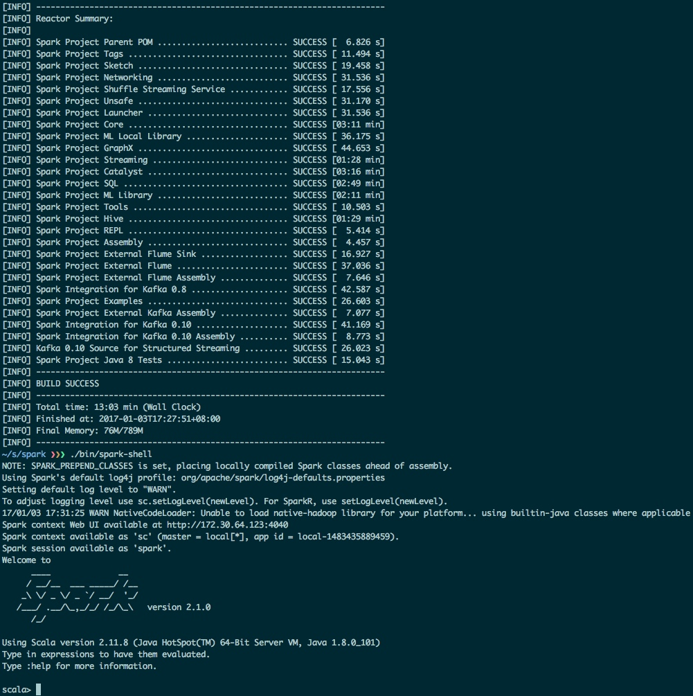

## 源码导入与代码调试
### 导入源码到Intellij IDEA 16
现在IDEA对scala支持已经比较完善，导入Spark工程非常简单：
> Menu -> File -> **Open** -> {spark dir}/**pom.xml** -> **Open as Project**

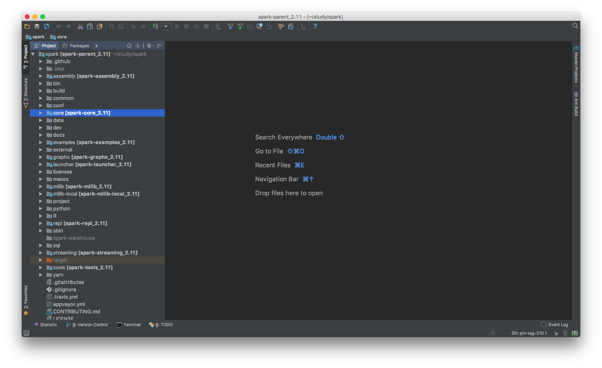
### 运行实例代码
导入工程后，介绍一下如何运行Spark项目自带的实例代码，在`{spark dir}/examples/`目录下，这里以`LogQuery`为例：
> command + o -> 输入LogQuery打开

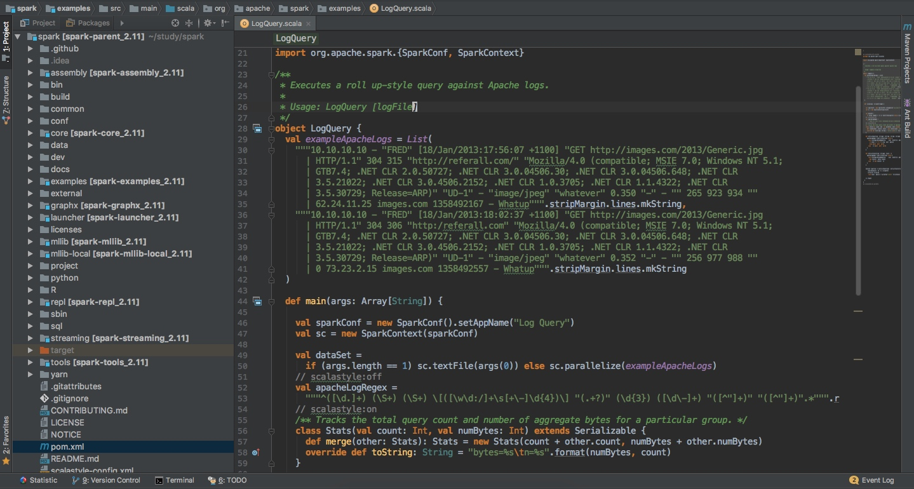

#### 1. 配置运行参数：

> Menu -> Run -> Edit Configurations -> 选择 + -> Application

参数配置如下：
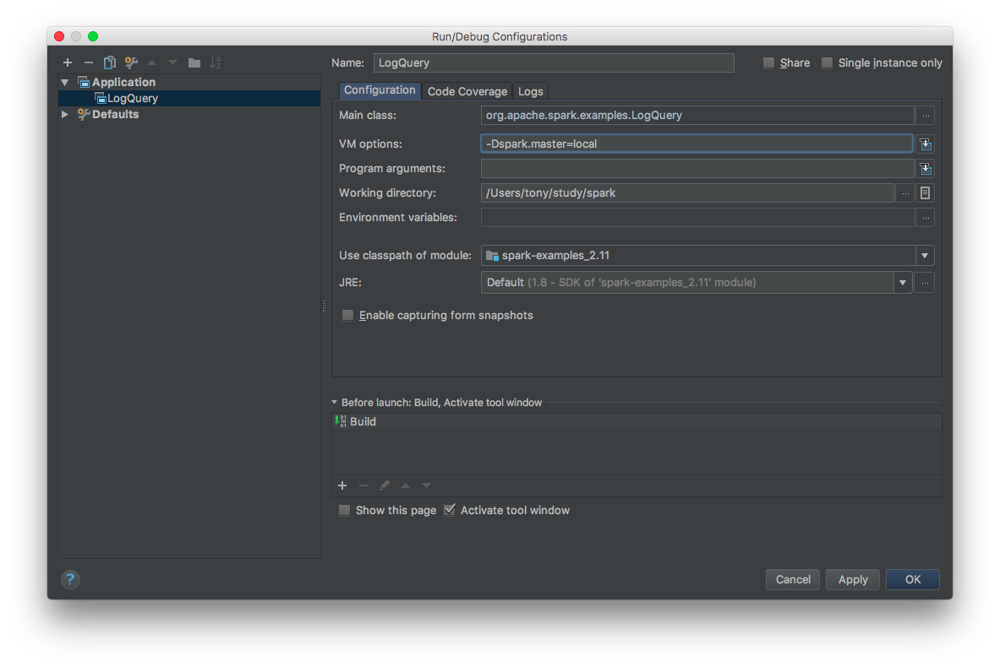
`VM options: -Dspark.master=local`代码使用本地模式运行Spark代码，也可以选择其他模式。
保存配置后，可以看到`LogQuery`在运行选项里了：
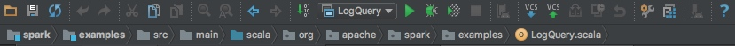

#### 2. 添加缺失的flume sink源代码
首次运行`LogQuery`会报错，因为IDE找不到flume依赖的部分源码：
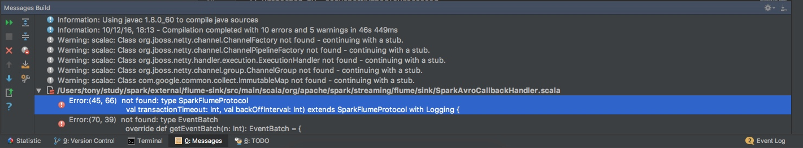
解决方案如下：
> Menu -> File -> Project Structure -> Modules -> spark-streaming-flume-sink_2.11 -> Sources
> 1. 把 target目录加入Sources（点击蓝色Sources）
> 2. 把子目录sink也加入Sources

参考下图，注意右边的Source Folders列表：
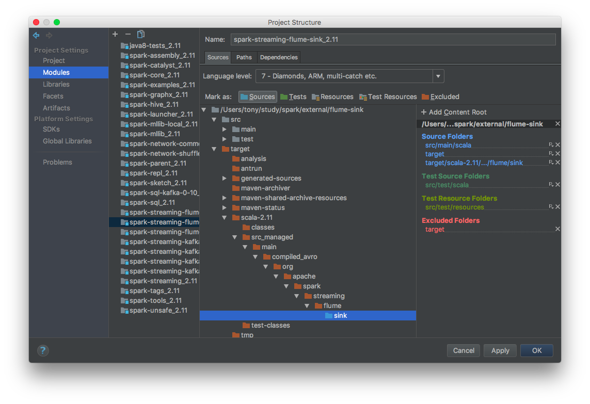
#### 3. 添加运行依赖的jars
再次运行，这次会花费比较长的时间，因为已经可以成功编译`LogQuery`啦，但是还是没能运行成功，报错如下：
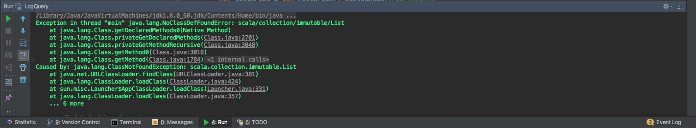
不要慌，这说明你的代码编译已经成功啦，运行出错的原因是，运行Spark App一般都是通过`spark-submit`命令，把你的jar运行到已经安装的Spark环境里，也就是所有的Spark依赖都已经有啦，现在你用IDE的方式，就会缺少依赖。

解决方案如下：
> Menu -> File -> Project Structure -> Modules -> spark-examples_2.11 -> Dependencies
> 添加依赖 jars -> {spark dir}/spark/assembly/target/scala-2.11/jars/

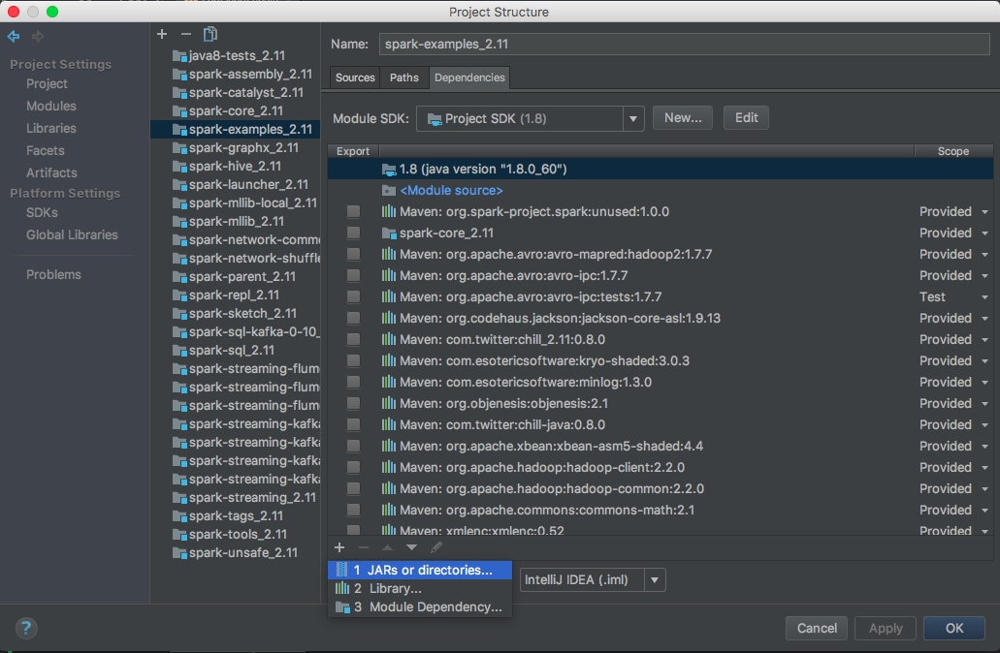

有两点需要注意：

* jars/*.jar: 这些依赖jars是在第一步编译打包Spark项目的时候产生的，如果这个目录是空的，或者修改了源代码想更新这些jars，可以用同样的命令再次编译Spark：

 ```
 $ build/mvn -T 4 -DskipTests clean package
 ```
 
* 从上图中右侧的Scope一栏可以看到，基本上所有依赖jars都是Provided，也就是说默认都是提供的，因为默认都是用`spark-submit`方式运行Spark App的。

#### 4. 成功运行实例代码
终于再次运行`LogQuery`的时候，可以看到输出啦：
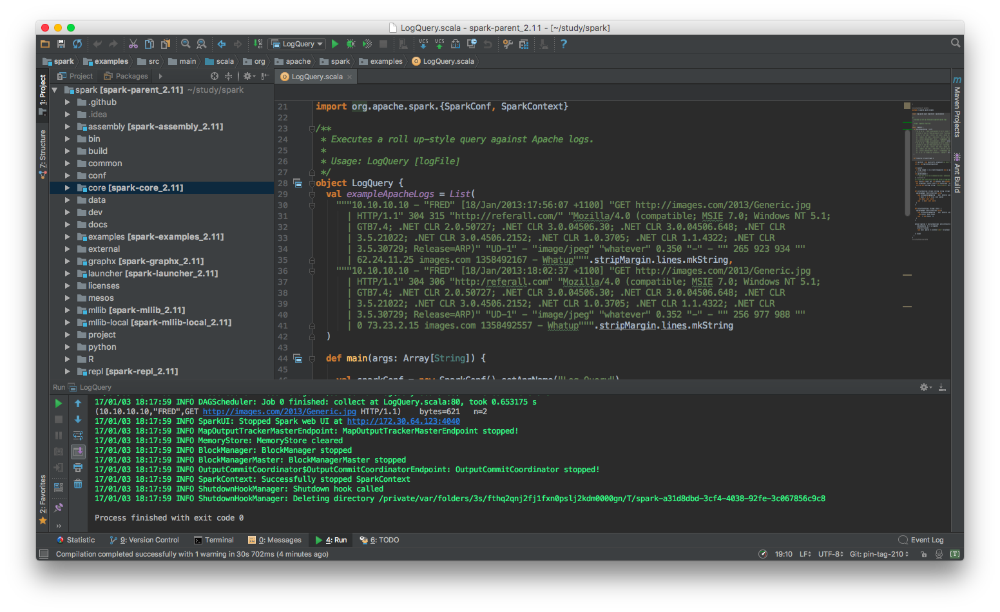
### 单步调试源代码
千辛万苦地终于让实例代码在IDE里跑起来了，是不是很有成就感。其实做了那么多的铺垫工作，在IDE里面运行代码的最大的一个好处是可以**单步调试**！
很简单，选择断点，然后`Run -> Debug`，可以看到中间变量值等等，其他的自行探索吧:
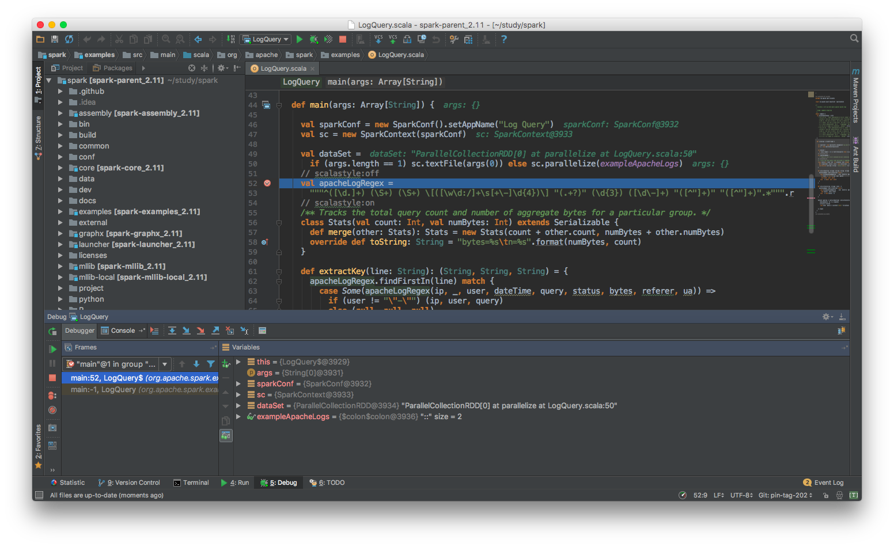


