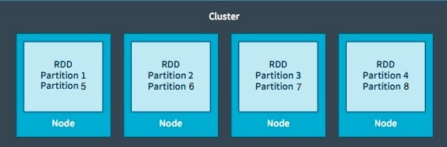
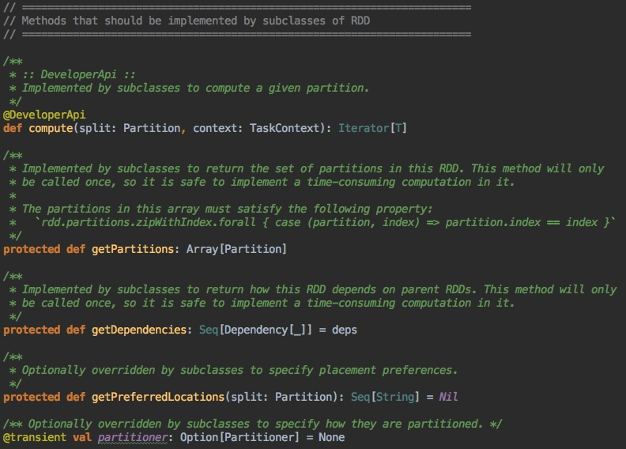
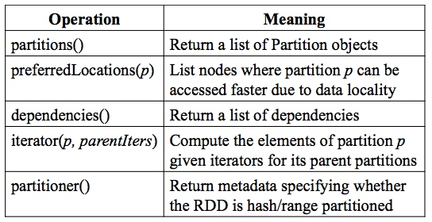
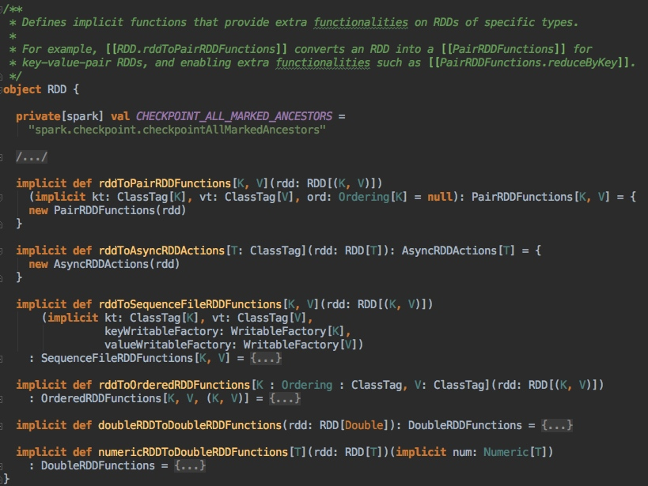
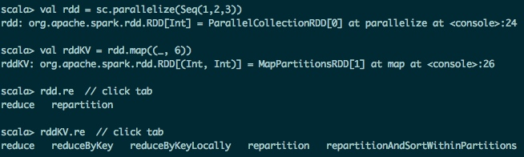

深入理解Spark RDD抽象模型和编写RDD函数
-------

* [Table of Contents](#table-of-contents)
	* [Spark基础知识](#spark基础知识)
	* [RDD抽象模型](#rdd抽象模型)
		* [设计动机](#设计动机)
		* [定义和特性](#定义和特性)
		* [Lineage和Dependencies](#lineage和dependencies)
	* [Spark的RDD源码阅读](#spark的rdd源码阅读)
		* [RDD编程接口](#rdd编程接口)
		* [RDD函数](#rdd函数)
		* [RDD隐式转换](#rdd隐式转换)
	* [编写RDD API函数](#编写rdd-api函数)

> Spark revolves around the concept of a resilient distributed dataset (RDD), which is an **immutable**, **fault-tolerant**, **partitioned** collection of elements that can be operated on in parallel. 

第二篇笔记介绍RDD，整个Spark项目的精髓所在，也是理解Spark源码的金钥匙。RDD是一个很棒的分布式计算抽象模型，它提供了通用的数据处理方法和高效的分布式容错机制，Spark是它的一种实现。

## Spark基础知识
开始正题之前，先简单介绍一些Spark的基本概念，以便深入介绍RDD。Spark的api运算函数分为两大类，**Transformation**和**Action**：Transformations是**lazy evaluation**的，调用他们只会被记录而不会被真正执行，只有遇到Actions，之前的Transformations才会被依次执行，这样的**Delay Scheduling**，Spark可以看到完整的计算流程图（以DAG有向无环图的形式表示），从而做更多的优化，Actions会返回结果给Driver或者保存结果到external storages。Spark的基本工作流程是，用户提交程序给cluster，用户的main函数会在**Driver**上面运行，根据用户的程序Spark会产生很多的**Jobs**，原则是遇到一个**Action**就产生一个**Job**，以DAG图的方式记录RDD之间的依赖关系，每一个Job又会根据这些依赖关系被DAGScheduler分成不同的**Stages**，每一个Stage是一个**TaskSet**，以TaskSet为单位，TaskScheduler通过Cluster Manager一批一批地调度到不同node上运行，同一个TaskSet里面的Task都做同样的运算，一个Partition对应一个Task。这个工作流程其实就是Spark的Scheduling Process，附上超经典的示意图，不要纠结这图上的细节，后面会有专门的笔记详细介绍这张***藏宝图***：


## RDD抽象模型
### 设计动机
当初设计RDD主要是为了解决三个问题：

* **Fast**: Spark之前的Hadoop用的是MapReduce的编程模型，没有很好的利用分布式内存系统，中间结果都需要保存到external disk，运行效率很低。RDD模型是in-memory computing的，中间结果不需要被物化（materialized），它的**persistence**机制，可以保存中间结果重复使用，对需要迭代运算的机器学习应用和交互式数据挖掘应用，加速显著。Spark快还有一个原因是开头提到过的**Delay Scheduling**机制，它得益于RDD的Dependency设计。

* **General: MapReduce**编程模型只能提供有限的运算种类（Map和Reduce），RDD希望支持更广泛更多样的operators（map，flatMap，filter等等），然后用户可以任意地组合他们。
> The ability of RDDs to accommodate computing needs that were previously met only by introducing new frameworks is, we believe, the most credible evidence of the power of the RDD abstraction.

* **Fault tolerance**: 其他的in-memory storage on clusters，基本单元是可变的，用细粒度更新（**fine-grained updates**）方式改变状态，如改变table/cell里面的值，这种模型的容错只能通过复制多个数据copy，需要传输大量的数据，容错效率低下。而RDD是**不可变的（immutable）**，通过粗粒度变换（**coarse-grained transformations**），比如map，filter和join，可以把相同的运算同时作用在许多数据单元上，这样的变换只会产生新的RDD而不改变旧的RDD。这种模型可以让Spark用**Lineage**很高效地容错（后面会有介绍）。

### 定义和特性
在开头的引用中，Spark官网给RDD的定义是：RDD is an **immutable**, **fault-tolerant**, **partitioned** collection of elements that can be operated on **in parallel**。可见RDD有以下几个特点：


* immutable：任何操作都不会改变RDD本身，只会创造新的RDD
* fault-tolerant：通过Lineage可以高效容错
* partitioned：RDD以partition作为最小存储和计算单元，分布在cluster的不同nodes上，一个node可以有多个partitions，一个partition只能在一个node上
* in parallel：一个Task对应一个partition，Tasks之间相互独立可以并行计算

另外还有两点

* persistence：用户可以把会被重复使用的RDDs保存到storage上（内存或者磁盘）
* partitioning：用户可以选择RDD元素被partitioned的方式来优化计算，比如两个需要被join的数据集可以用相同的方式做hash-partitioned，这样可以减少shuffle提高性能

RDD可以通过两种方式产生，读取外部数据集（比如HadoopRDD）和通过Transformations从其他RDDs转变而来（比如FilteredRDD）。

### Lineage和Dependencies
Spark会记录用于产生某个RDD的所有transformations，称为**Lineage**，更加直白地理解就是一个RDD知道它是如果从它的父辈RDD们转换而来的，下图是一个RDD Lineage Graph，它是一种DAG Graph：

> Lineage是Spark高效容错的法宝，因为有了Lineage信息，RDD可以重新单独计算某个丢失的partition，而不用计算整个RDD。

Lineage基于RDD的Dependencies，所以Lineage Graph也可以说成Dependency Graph。RDD的Dependencies可以分为两类：窄依赖（**Narrow Dependencies**）和宽依赖（**Wide Dependencies**）。下图就是Dependency Graphs, 每个大方框是一个RDD，蓝色的小矩阵是对应的Partitions：

> 如果输入RDD的每个Partition只指向（用于计算）输出RDD的一个Partition时，是窄依赖，否则的话就是宽依赖

Spark的DAGScheduler就是基于Dependencies来划分stages的（之后会有笔记介绍），因为窄依赖里面的运算符可以被pipeline在一起（不需要shuffle），用一个Task直接计算。

## Spark的RDD源码阅读
有了前面的理论准备，现在可以开始阅读Spark的RDD模型源码实现了。开始之前，请确保你已经参考我的第一篇笔记[搭建Spark源码研读和代码调试的开发环境](ide-setup.md)，用Intellij IDEA打开了Spark项目，并且编译通过，然后
> command + o, 输入RDD，打开org.apache.spark.rdd.RDD (RDD.scala文件)

### RDD编程接口
Spark的RDD编程接口是一个抽象类，实例化需要输入SparkContext和RDD的Dependencies，解释两点：

* `RDD[T: ClassTag]`： T代表了RDD每个元素的type，比如RDD[Int]代表每个元素是Int型。
* `Seq[Dependency[_]]`：代表RDD的父辈RDD们的类型是可以任意的，而不是一定要和这个RDD一样，比如`RDD[Int]`通过`map(f: Int => String)`运算可以变成`RDD[String]`。

```
abstract class RDD[T: ClassTag](
    @transient private var _sc: SparkContext,
    @transient private var deps: Seq[Dependency[_]]
  ) extends Serializable with Logging {
  ...
}
```

为了实现前一节介绍的那些RDD特性，Spark实现的RDD模型包含五个主要的属性：

* A list of **partitions**
* A **function** for computing each partition
* A list of **dependencies** on other RDDs
* Optionally, a **Partitioner** for key-value RDDs (e.g. to say that the RDD is hash-partitioned)
* Optionally, a list of **preferred locations** to compute each partition on (e.g. block locations for an HDFS file)

每一个RDD子类都必须实现这些属性（在源码里面是函数）：


比如

* HadoopRDD
	* partitions = one per HDFS block
	* dependencies = none
	* compute(partition) = read corresponding block
	* preferredLocations(part) = HDFS block location 
	* partitioner = none

* FilteredRDD
	* partitions = same as parent RDD
	* dependencies = “one-to-one” on parent
	* compute(partition) = compute parent and filter it
	* preferredLocations(part) = none (ask parent) 
	* partitioner = none

* JoinedRDD
	* partitions = one per reduce task
	* dependencies = “shuffle” on each parent 
	* compute(partition) = read and join shuffled data
	* preferredLocations(part) = none
	* partitioner = HashPartitioner(numTasks)

### RDD函数
RDD抽象类的源码可以分成几大部分：

* 必须被子类实现的方法
* 所有RDD都拥有的方法和属性
 * persistence相关的函数
 * 用于表示RDD的接口函数
 
 * Transformations（返回新的RDD）
 * Actions (启动一个job来计算结果)
 
* 其他内部使用的方法和属性

现在可以先阅读Transformations函数源码，其他的会在后面的笔记里面涉及，因为Actions都会调用`sc.runJon()`来运行job，深入理解Spark Scheduling之后再阅读会比较容易理解。
这里以**flatMap**为例：

```
/**
 *  Return a new RDD by first applying a function to all elements of this
 *  RDD, and then flattening the results.
 */
def flatMap[U: ClassTag](f: T => TraversableOnce[U]): RDD[U] = withScope {
  val cleanF = sc.clean(f)
  new MapPartitionsRDD[U, T](this, (context, pid, iter) => iter.flatMap(cleanF))
}
```
flatMap的功能是对RDD[T]类型的RDD上的每一个元素运行函数f，返回类型为RDD[U]的RDD。
`withScope{body}`是为了确保运行body代码块产生的所有RDDs都在同一个scope里面。`val cleanF = sc.clean(f)`是为了确保这个f函数（专业称为closure）是可以被序列化的，因为它需要被序列化后发送到不同的node上。想要了解他们的实现细节可以用IDE代码跳转功能：

> 在Intellij里面你可以选择一个函数或者变量，然后Command + b，跳转到它的实现细节，command + [ 可以返回原来的地方

这一行代码是关键所在，实例化了一个MapPartitionsRDD，返回的是RDD[U]类型：

```
new MapPartitionsRDD[U, T](this, (context, pid, iter) => iter.flatMap(cleanF))
```

> 选择MapPartitionsRDD，command + b, 跳转到它的实现

MapPartitionsRDD[U, T]是RDD[U]的子类，它的源码很好的诠释了如何使用RDD编程接口:

```
/**
 * An RDD that applies the provided function to every partition of the parent RDD.
 */
private[spark] class MapPartitionsRDD[U: ClassTag, T: ClassTag](
    var prev: RDD[T],
    f: (TaskContext, Int, Iterator[T]) => Iterator[U],  // (TaskContext, partition index, iterator)
    preservesPartitioning: Boolean = false)
  extends RDD[U](prev) {

  override val partitioner = if (preservesPartitioning) firstParent[T].partitioner else None

  override def getPartitions: Array[Partition] = firstParent[T].partitions

  override def compute(split: Partition, context: TaskContext): Iterator[U] =
    f(context, split.index, firstParent[T].iterator(split, context))

  override def clearDependencies() {
    super.clearDependencies()
    prev = null
  }
}
```

MapPartitionsRDD[U, T]的partitioner和它的第一个parent RDD的partitioner保持一致（如果需要保留partitioner的话），它的partitions就是它的firstParent的partitions。它的compute函数只是调用了flatMap实例化它时输入的函数。
再次聚焦需要传递的函数的函数类型, 实际传递的函数和调用它的代码：

```
f: (TaskContext, Int, Iterator[T]) => Iterator[U],  // (TaskContext, partition index, iterator)

(context, pid, iter) => iter.flatMap(cleanF)

f(context, split.index, firstParent[T].iterator(split, context))
```

iter：Iterator[T]是一个Partition上的元素迭代器，用来遍历RDD[T]的第pid个partition上的所有元素。`firstParent[T].iterator(split, context)`就是返回parentRDD的对应partition的迭代器iter：Iterator[T]： 如果已经保存了就直接读取，否则重新计算（可以跳转看它的实现）。有了这个迭代器iter之后，然后用`iter.flatMap(cleanF)`来产生新的迭代器，返回类型是Iterator[U]，这个就是最终返回的RDD: RDD[U]的partition的迭代器啦。`iter.flatMap(cleanF)`只是纯粹的scala flatMap计算，在不同的node上运行。
这部分内容，可能比较绕，只有看着源码不断的跳转，才能比较好的理解。高度总结一下，Transformations函数的实现，就是对RDD上每一个partition的iterator进行相应的操作。

### RDD隐式转换
在RDD.scala文件的最后有一个object RDD，这个很有意思，也体现了scala implicit的强大之处:
它的作用就是在编译代码的时候，scala编译器会自动识别特定类型的RDD，然后调用对应的implicit function来扩展这种特定类型的RDD的api函数，比如scala编译器看到RDD[K, V]，就会调用这个函数

```
implicit def rddToPairRDDFunctions[K, V](rdd: RDD[(K, V)])
    (implicit kt: ClassTag[K], vt: ClassTag[V], ord: Ordering[K] = null): PairRDDFunctions[K, V] = {
  new PairRDDFunctions(rdd)
}
```
然后这个RDD就拥有PairRDDFunctions类里面的专属函数啦：



## 编写RDD API函数
只说不练假把式，终于到了动手环节了，打起精神啦！任务是编写一个和scala的flatten函数类似的RDD API函数:

```
scala> Seq(Seq(1,2), Seq(3)).flatten
res0: Seq[Int] = List(1, 2, 3)
```
虽然它可以用`flatMap(x => x)`来代替（这也是为什么spark RDD api函数里面没有它），但是自己动手实现一下这个简单的api函数，可以加深对RDD模型的理解，也能熟悉Spark开发流程，甚至贡献代码给社区。

### 使用
参考[Scala flatten](https://github.com/scala/scala/blob/2.11.x/src/library/scala/collection/generic/GenericTraversableTemplate.scala#L169)的实现源码和Spark flatMap的实现源码:

```
def flatten[B](implicit asTraversable: A => GenTraversableOnce[B]): CC[B] = {
  val b = genericBuilder[B]
  for (xs <- sequential)
    b ++= asTraversable(xs).seq
  b.result()
}

def flatMap[U: ClassTag](f: T => TraversableOnce[U]): RDD[U] = withScope {
  val cleanF = sc.clean(f)
  new MapPartitionsRDD[U, T](this, (context, pid, iter) => iter.flatMap(cleanF))
}
```

可以编写spark flatten api函数如下：

```
def flatten[U: ClassTag](implicit asTraversable: T => TraversableOnce[U]): RDD[U] = withScope {
  val f = (x: T) => asTraversable(x)
  val cleanF = sc.clean(f)
  new MapPartitionsRDD[U, T](this, (context, pid, iter) => iter.flatMap(cleanF))
}
```
asTraversable隐式函数，是为了把type T隐式地转换为可以遍历的TraversableOnce[U]类型，因为可以flatten的数据集的元素必定是可以遍历的类型，比如Seq[Int]。为什么要这样转换，因为Spark代码里面，RDD[T]的元素（也是`iter`迭代器的元素）类型是T，编译器并不知道T是否是可遍历类型，也就不能进一步flatten啦（你无法直接iter.flatten会编译不通过）。

```
git checkout -b SN-add-rdd-flatten
export SPARK_PREPEND_CLASSES=true
./build/sbt compile


```


### 使用RDD隐式转换

